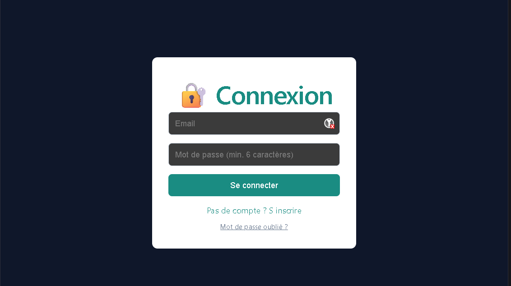

# Project R209 mon-Kanban

A brief description of what this project does and who it's for

[Lien vers l'application déployé](https://r209-kanban.vercel.app)

## Auteurs

- [@Drac1283](https://github.com/Drac1283)
- [@aymenboumliki](https://github.com/aymenboumliki)

## Stack Technique

### Environnement & Frontend


### Backend & Database


### Services & Déploiement


## Installation du projet

Cloner le projet

```bash
  git clone https://github.com/Drac1283/mon-kanban.git
```

Aller dans le répertoire

```bash
  cd mon-kanban
```

Installer les dépendance

```bash
  npm install
  npm install -g vercel
```

démarrer le serveur

```bash
  vercel dev
```

## Image


